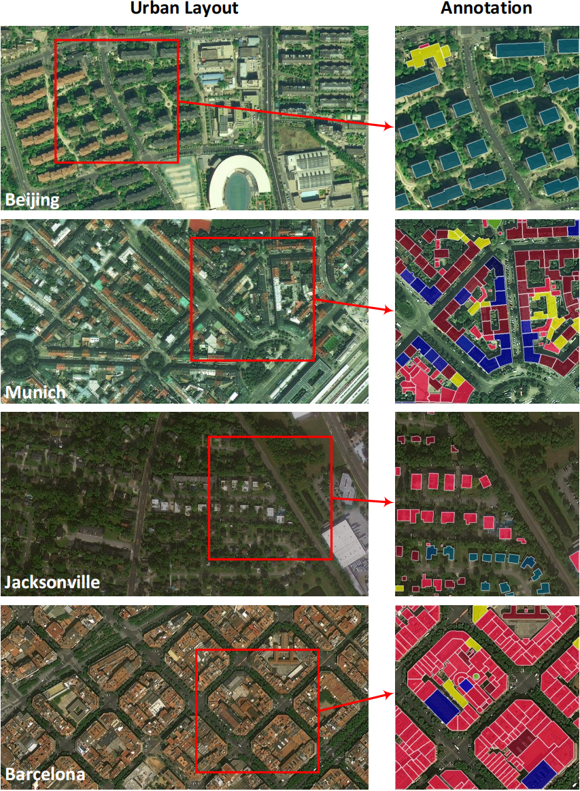
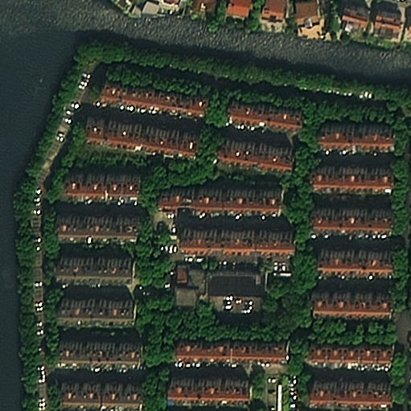
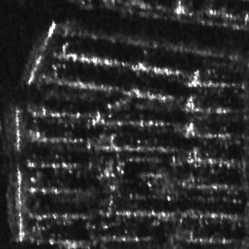
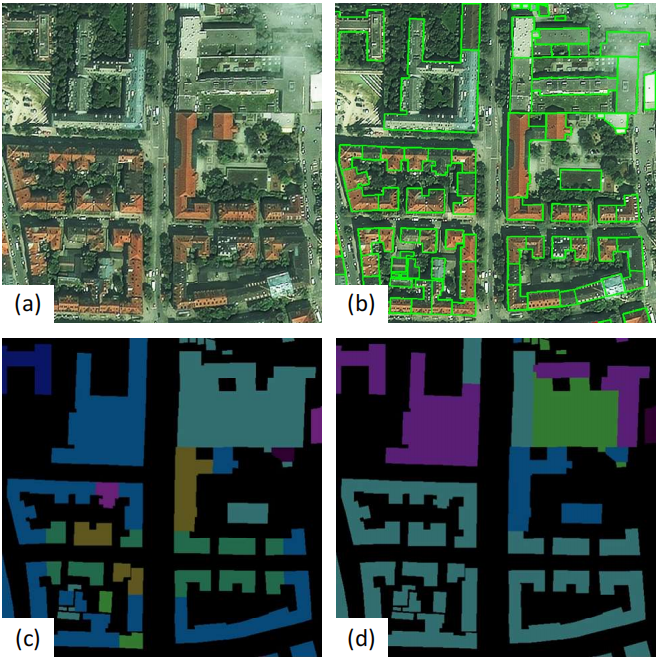

# UBC-dataset
A Fine-grained Urban Building Classification dataset

## Update!
We have finished our work on UBCv2! There are two improvements in the UBCv2 dataset:
- 20 global cities with various layouts and styles.
- RGB and SAR image pairs for multi-modal research.

The manuscript of UBCv2 has been accepted by IEEE Transactions on Geoscience and Remote Sensing. The complete UBCv2 dataset is now available.
In this paper, we propose a Class-wise Geometrical Transformer (CGT) module to improve the performance of general two-stage instance segmentation models for fine-grained building classification.

## Introduction of UBCv2
UBCv2 consists of VHR optical images of 20 unique cities worldwide, for 17 of them finely aligned pairs of optical and Synthetic Aperture Radar (SAR) images are available. An extensive annotation is performed for about 0.5 million building instances with individual polygons and fine-grained roof type category with 12 classes. The annotation of building functions of two cities in the previous version (UBCv1) is also integrated.

Here is four typical cities in UBCv2.



Four selected urban areas with typical architectural characteristics (left) and annotation details in the image tiles (right) in the UBCv2 dataset. Colors indicate various classes of roof types. Buildings in different cities show a large diversity of layout as well as architectural style.

Here is a RGB and SAR image pair example in UBCv2.

<p float="left">
  
   
</p>

 Example of a multi-modal image pair: The RGB (left) and the SAR (right) image are finely registered.

Here is several baseline results we run on UBCv2:

Model | AP | AP50 | FL | GA | GM | RO | ME | H1 | H2 | MA | PM | AR | RE | OT
--- | --- | --- | --- | --- | --- | --- | --- | --- | --- | --- | --- | --- | --- | --- 
SOLOv2 | 14.2 | 24.0 | 24.6 | 21.3 | 27.7 | 5.8 | 9.5 | 7.6 | 35.0 | 3.6 | 4.6 | 14.8 | **11.2** | 6.1
QueryInst | 15.3 | 25.2 | 25.5 | 23.4 | 28.6 | 5.1 | 24.2 | 8.9 | 33.9 | 7 | 4.8 | 13.9 | 4.5 | 5.5
Mask R-CNN | 15.5 | 25.9 | 25.8 | 24.7 | **29.2** | 5.1 | 12.3 | 10 | 39 | 5.4 | 5.6 | 16.8 | 5.8 | **7.2**
C Mask R-CNN | 16.5 | 26.9 | 26.5 | 24.5 | 29.1 | 4.7 | 19.7 | 10.9 | 38.6 | 6 | **7** | **18.5** | 6.7 | 6.4
Mask R-CNN + CGT | 16.3 | 26.3 | 25.2 | **25.1** | 27.4 | **9.0** | 21.6 | 9.8 | 39.6 | 5.7 | 5.8 | 17.2 | 3.2 | 6.8
C Mask R-CNN + CGT | **17.1** | **27.1** | **27.2** | 25.0 | 28.6 | 6.6 | **24.9** | **11.1** | **39.8** | **7.7** | 5.8 | 16.4 | 5.7 | 7.2

## Introduction of UBCv1
We present a dataset for building detection and classification from very high-resolution satellite imagery with the focus on object-level interpretation of individual buildings.
It is meant to provide not only a flexible test platform for object detection algorithms but also a solid basis for the comparison of city morphologies and the investigation of urban planning.

The details of this dataset can be seen in paper [Urban Building Classification (UBC) – A Dataset for Individual Building Detection and Classification from Satellite Imagery](https://ieeexplore.ieee.org/document/9857458/).

Here is an example of the annotation.



Input image (a), building footprints (b, green polygons), roof types (c) and functions (d, coarse classes)

## Download
Currently, we only provide the standard [COCO](https://cocodataset.org/#home) instance segmentation format.

### UBCv1
Annotations of roof coarse, roof fine and use coarse are build. 

The train and valitation set of this dataset can be downloaded from:

BaiduNetdisk: [https://pan.baidu.com/s/1M6yYD1lvbqsVpn5MHGa2tg?pwd=7hbm](https://pan.baidu.com/s/1M6yYD1lvbqsVpn5MHGa2tg?pwd=7hbm) password: 7hbm

Google Grive: [https://drive.google.com/file/d/1XnKFKqjoa95PLXFw01HcXx4Az49Qw37i/view?usp=sharing](https://drive.google.com/file/d/1XnKFKqjoa95PLXFw01HcXx4Az49Qw37i/view?usp=sharing)

### UBCv2
Fine-grained building roof instance segmentation. The train and valitation set of this dataset can be downloaded from:

BaiduNetdisk: link will be added after the publication.

Google Grive: link will be added after the publication.

Multi-modal fine-grained building roof instance segmentation (RGB + SAR). The train and valitation set of this dataset can be downloaded from:

BaiduNetdisk: link will be added after the publication.

Google Grive: link will be added after the publication.

## References
If you use the UBCv1 dataset, please cite our paper on CVPR workshops, 2022:
```
@INPROCEEDINGS{9857458,
  author={Huang, Xingliang and Ren, Libo and Liu, Chenglong and Wang, Yixuan and Yu, Hongfeng and Schmitt, Michael and Hänsch, Ronny and Sun, Xian and Huang, Hai and Mayer, Helmut},
  booktitle={2022 IEEE/CVF Conference on Computer Vision and Pattern Recognition Workshops (CVPRW)}, 
  title={Urban Building Classification (UBC) – A Dataset for Individual Building Detection and Classification from Satellite Imagery}, 
  year={2022},
  volume={},
  number={},
  pages={1412-1420},
  doi={10.1109/CVPRW56347.2022.00147}}
```
The citation of UBCv2 link will be added after the publication.
